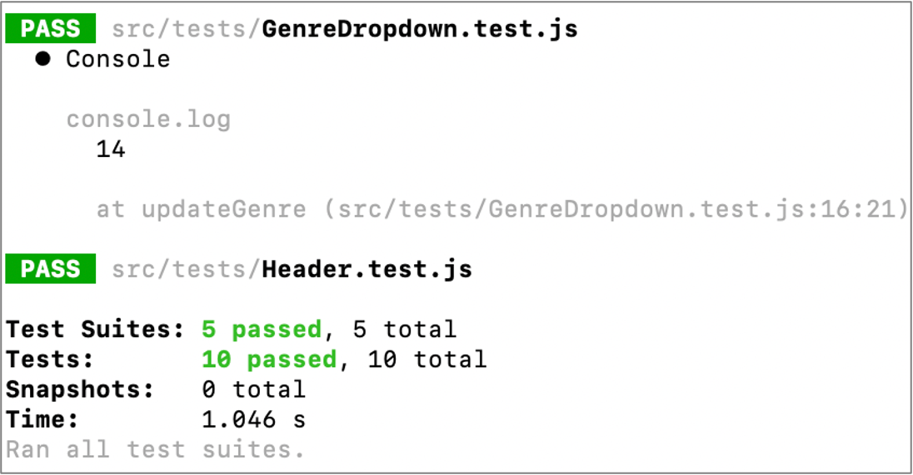
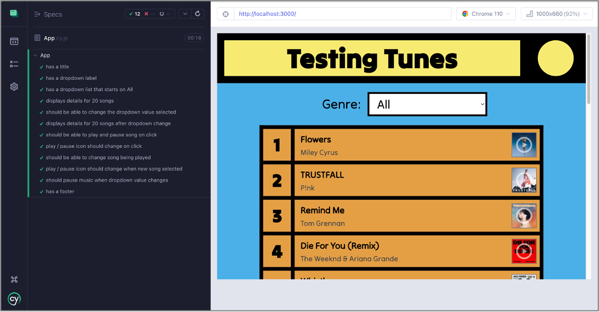
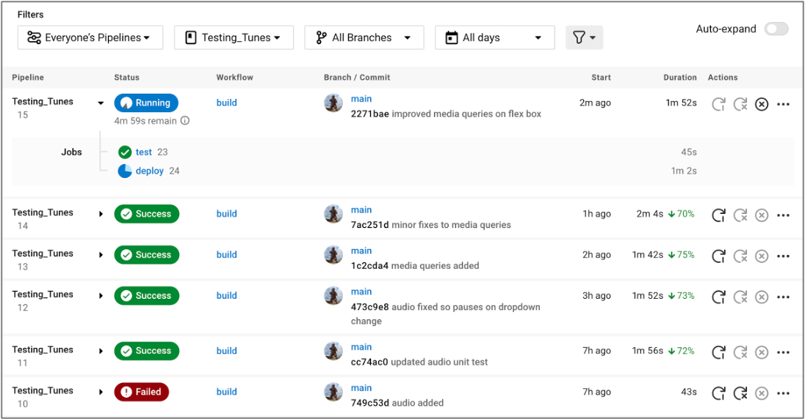

# Testing Tunes

A personal weekend project with a focus on testing and applying CI / CD. 

Testing packages used were Jest (unit testing) and Cypress (end-to-end). CircleCI was used to support CI / CD and the [live app is hosted via AWS / S3](http://testing-tunes-lc.s3-website.eu-west-2.amazonaws.com/).   




The app itself is a front-end JavaScript / React app that uses the iTunes API to display the current top 20. I have also incorporated the ability to listen to a demo of each song, and to view the genre-specific top 20 for all genres that appear in the overall top 20. 

The design of the app was inspired by an old Top of the Pops logo:   
(!Image of Top of the Pops logo used for design inspiration)

## Getting Started
These instructions should get you a copy of the project up and running on your local machine for development purposes:

Install client dependencies:
```
npm install
```

Run the client:
```
npm start
```

Run unit tests using Jest:
```
npm run test
```

Run end-to-end tests in Cypress:
```
npm run test:e2e
```
